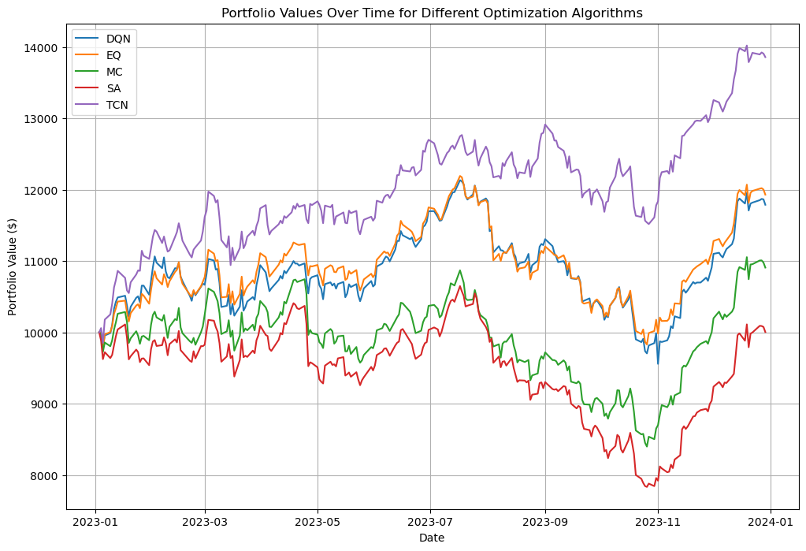

# Portfolio Optimization Project

This project focuses on optimizing portfolio allocation using classical financial models, machine learning techniques, and reinforcement learning. The objective is to achieve better risk-adjusted returns by implementing, comparing, and analyzing various strategies.

---

## Features

1. **Data Handling**

   - Utilized SQLAlchemy for data management.
   - Preprocessed data for selected tickers.
   - Calculated log returns for all tickers.

2. **Historical Data Usage**

   - **5 years** of historical data for training (2018 - 2022).
   - **1 year** of data for testing and evaluation (2023).

3. **Models Implemented**

   - **Classical Models**

     - Monte Carlo simulation.
     - Simulated annealing.

   - **Machine Learning**

     - Temporal Convolutional Networks (TCNs) with a custom loss function.
     - Reinforcement learning using OpenAI Gym.

4. **Metrics**

   - **Sharpe Ratio**.
   - **Total Returns** (annual).

5. **Stock Selection**

   - K-Means clustering for initial stock filtering.

---

## Installation and Setup

### Prerequisites

- Python 3.10.9
- Required Libraries:
  - BeautifulSoup4 4.12.3
  - Dash 2.18.1
  - DEAP 1.4.1
  - Gym 0.26.2
  - Keras 2.13.1
  - Matplotlib 3.7.2
  - NumPy 1.24.3
  - Pandas 2.0.3
  - Plotly 5.24.1
  - PyKalman 0.9.7
  - Requests 2.32.3
  - Scikit-Learn 1.3.0
  - SciPy 1.9.1
  - SQLAlchemy 2.0.24
  - Statsmodels 0.14.0
  - TensorFlow 2.13.0
  - TensorFlow-Intel 2.13.0
  - TextBlob 0.18.0.post0
  - Torch 2.1.2
  - yfinance 0.2.44

### Steps

1. Clone the repository:
   ```bash
   git clone <repository_url>
   ```
2. Set up a virtual environment:
   ```bash
   python -m venv venv
   source venv/bin/activate  # On Windows: venv\Scripts\activate
   ```
3. Install dependencies:
   ```bash
   pip install -r requirements.txt
   ```

---

---

## Results

- **Optimal Portfolio Weights**: Derived using various optimization techniques.
- **Performance Metrics**: Achieved a higher Sharpe Ratio and total returns compared to benchmarks.

- **Portfolio Performance Over Time**:
  


---

## Future Enhancements

- Integrate advanced deep learning models like sentiment analysis and predictive models.
- Explore alternative risk metrics (e.g., Maximum Drawdown).
- Integrate real-time stock data for live portfolio optimization.

---

## License

This project is licensed under the MIT License. See the `LICENSE` file for more details.

